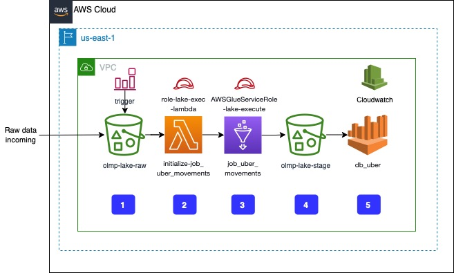

# Loka Lake Challenge

The solution for the Loka data lake challenge uses a serverless approach to leverage administrated services. It would be the equivalent of the T step on an ETL pipeline architecture.

To reduce the maintenance burden and to provide a solution that works out of the box, The following services are in place: 
* S3 for storage services for both the source and the target data
* Lambda as a way to trigger the data processing pipeline 
* Glue to run any required transformations (More on this later)
* Athena to simplify the data access
* AWS CDK to automate the solution deployment

## Architecture

The processing pipeline starts when a new file arrives in the source bucket: **olmp-lake-raw**. This bucket stores the raw data only. 
When the new file is uploaded, an S3 event is triggered. This event generates a lambda function (**initialize-job_uber_movements**) execution which initiates the transformation step to pass the transformed data to the target bucket. 

The transformations applied to the data improves performance and scalability. In the transformation step, the job extracts the start date from the date range to use as part of the partition key. That way, the data is arranged in city->year->month->day, which allows faster searches and supports high volumes of data. Also, the transformation step, run within an AWS Glue Job (**job_uber_movements**), is where the data is serialized and compressed. 
It's important to mention that choosing Glue is mainly to scale the solution along with the volume of data.

The format chosen to store the data is Parquet with Snappy compression. It ensures data is well compressed in a columnar format, making storage and access much more efficient. It also helps to keep file sizes smaller.

For debugging purposes, logs are available in Cloudwatch.

Finally, any data processed will be immediately available in an Athena table, which provides an SQL interface for users to consume the data. 

## How to execute the solution

Prerequisites:
- AWS account
- CDK prerequisites install in your computer
- Programmatic keys configuration

After downloading GitHub repository
- Create and activate a virtual environment `source .venv/bin/activate`
- Install all dependencies `pip install -r requirements.txt`
- `cdk synth` to prepare AWS account executing the app
- `make deploy` to deploy the **LakeStack** stack. **Important** to use the make file instead so it coordinates the whole stack provisioning. 

## Future Work
- Improve security configuring like VPC, AWS ACL and IAM Roles restricted.
- CDK deploy stack is not follow the script order.